# Ray Tracing Scala

This repository hosts my take on  [_Ray Tracing in One Weekend Book Series_](https://raytracing.github.io/) using
[Scala](https://www.scala-lang.org/) and functional programming.

The goal behind this project is really just:
1. Further develop my Scala and Functional Programming skills
2. Try out Scala tools, such as:
   1. [ScalaTest](https://www.scalatest.org/) for testing
   2. [Scalafmt](https://scalameta.org/scalafmt/) for linting and formatting
3. Have some fun with basic Computer Graphics

This document is divided in 3 sections (one for each book of the series). In each section you'll find the generated
image after each new feature implementation as well as a brief explanation of my implementation.

> ⚠️ Code snippets on this README are simplified for readibility reasons ⚠️

## Book 1: [_Ray Tracing in One Weekend_](https://raytracing.github.io/books/RayTracingInOneWeekend.html)

### 1. Outputing an image

Everytime you need to create a file and write some content to it, you always end up Googling how to do it.
In an effort to save you some time, take a look at [How to write to a File in Scala](https://www.educba.com/scala-write-to-file/)
and the [PPM file format specification](https://netpbm.sourceforge.net/doc/ppm.html)

#### The `.ppm` file format

In a nutshell the PPM file specification consists of a grid of colors.
The colors can be represented in RGB or any other format, but let's keep in simple with RGB (0-255)
Take a look at the following example from [Wikipedia](https://en.wikipedia.org/wiki/Netpbm):

```ppm
P3           
# "P3" means this is a RGB color image in ASCII 
# "3 2" is the width and height of the image in pixels
# "255" is the maximum value for each color
# This, up through the "255" line below are the header.
# Everything after that is the image data: RGB triplets.
# In order: red, green, blue, yellow, white, and black.
3 2         
255       
255   0   0   0 255   0   0   0 255
255 255   0 255 255 255   0   0   0
```

which will show up as:

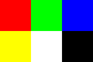

#### Defining the `Color` and `Image` case class

We'll be using Scala's [`case class`](https://docs.scala-lang.org/scala3/book/domain-modeling-tools.html#case-classes), [`object`](https://docs.scala-lang.org/scala3/book/domain-modeling-tools.html#objects) and [`enum`](https://docs.scala-lang.org/scala3/book/domain-modeling-tools.html#Enums_Scala_3_only), just because they seem to be better suited for [FP data modeling](https://docs.scala-lang.org/scala3/book/domain-modeling-fp.html)

Defining a `Color` is pretty straightforward, and you can use a [companion object](https://docs.scala-lang.org/scala3/book/domain-modeling-fp.html#companion-object)
to declare static like functions and constants.

```scala
case class Color (red: Int, green: Int, blue: Int)

object Color:
  val BYTE_SIZE = 255
  def white: Color = Color(255, 255, 255)
  def black: Color = Color(0, 0, 0)
end Color
```

we can then override the `toString` method to make the code easier to read:

```scala
override def toString: String = s"$red $green $blue"
```

We'll need a data structure to model an image, something like this should do the trick:

```scala
case class Image(width: Int, height: Int, content: Seq[Seq[Color]] = Seq.empty)
```

We can then declare some methods to write the `Image`'s content to a file:

```scala
def rowToString(row: Seq[Color]): String = row
  .foldLeft("")((accRow, byte) => s"$accRow$byte ")
  .trim

def write(writer: PrintWriter): Unit =
  // header
  writer.write(s"P3\n$width $height\n${Color.BYTE_SIZE}\n")
  // content
  content.foreach(writer.write(s"${rowToString(_)}\n")
```

##### The rainbow effect

Just for fun, let's create a rainbow effect given the Image's height and width.
This is an excellent case to use [`Seq.tabulate`](https://www.scala-lang.org/api/3.3.0/scala/collection/immutable/Seq$.html#tabulate-e34).

```scala
def fillRainbow(): Image = copy(
  content = Seq.tabulate[Color](this.height, this.width)((h: Int, w: Int) =>
    val r = w.toDouble / (this.width - 1)
    val g = (this.height - 1 - h).toDouble / (this.width - 1)
    val b = 0.25
    Color.fromRatio(r, g, b)
  )
)
```

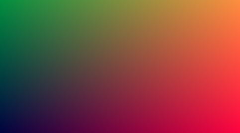

### 2. The `Vec3` class

This part is very similar to the original approach in C++, just take a look at the `Vec3.scala` file, and you'll
quickly grasp this data structure.

However, unlike the original approach **`Vec3` is not used for colors, just 3-dimensional vectors and coordinates**.

### 3. Rays, camera and Background

Declaring a ray function ($P(t) = A + tb$), where:

- $A$ is the ray's origin
- $b$ is the ray's direction

is as easy as:

```scala
case class Ray(origin: Vec3, direction: Vec3):
  def at(t: Double): Vec3 = origin + t * direction
```

Now we just need to calculate the linear interpolation between white and blue given the ray's direction y-axis value
(which will be a value between -1 and 1). Take a look at `Color.lerpStart` to better understand the implementation details,
but in a nutshell it's just an implementation of the following formula:

$$ color = (1 − t) * startColor + t * endColor $$

where:
- $t$ is a value between 0 and 1

```scala
def rayColor(ray: Ray): Color =
  Color.white.lerpStart(0.5 * (ray.direction.unit.y + 1.0), Color.skyBlue)
```


### 4. Adding a Sphere

Let's create a `Sphere` case class to encapsulate its logic in one place. If you're not like me and remember your geometry
classes, you know that a sphere's equation is something like:

$$
(x - c_x)^2 + (z - c_z)^2 + (z - c_z)^2 = r^2
$$

where:
- $r$ = sphere radius
- $(c_x, c_y, c_z)$ = is the 3-dimensional coordinate in the center of the Sphere

This means that if:
- $(x - c_x)^2 + (z - c_z)^2 + (z - c_z)^2 > r^2$ then $(x, y, z)$ is **outside** the sphere;
- $(x - c_x)^2 + (z - c_z)^2 + (z - c_z)^2 < r^2$ then $(x, y, z)$ is **inside** the sphere;

With this in mind, I recommend you go over the book's explanation on [Ray-Sphere Intersection](https://raytracing.github.io/books/RayTracingInOneWeekend.html#addingasphere/ray-sphereintersection)
and to better understand the math behind the actual implementation.

```scala
case class Sphere(center: Vec3 = Vec3.zero, radius: Double = 1):
   def hit(ray: Ray): Boolean =
      val origin       = ray.origin - center
      val a            = ray.direction.dot(ray.direction)
      val b            = 2.0 * origin.dot(ray.direction)
      val c            = origin.dot(origin) - Math.pow(radius, 2)
      val discriminant = Math.pow(b, 2) - 4 * a * c
      
      !(discriminant < 0)
```

Now we need to update the `rayColor` function to render a red colored pixel when a Sphere is hit. Let's test this out
by hardcoding a Sphere in the middle of the Scene:

```scala
def rayColor(ray: Ray): Color =
  if (Sphere(Vec3(0, 0, -1), 0.5).hit(ray)) then
    Color.red
  else
    Color.white.lerpStart(0.5 * (ray.direction.unit.y + 1.0), Color.skyBlue)
```

And we'll get an Image which looks like this:

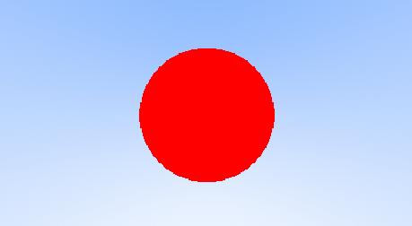

### 5. Surface Normals and Multiple Objects

Take a look at [Shading with Surface Normals](https://raytracing.github.io/books/RayTracingInOneWeekend.html#surfacenormalsandmultipleobjects/shadingwithsurfacenormals)
section for a theoretical background on how shading is done.

What we have to understand is that not only do we want to know if a ray hit the Sphere, but we also need to grab:
1. $t$: how far away from the ray's origin was the hit
2. $p$: the hit coordinates
3. $n$: the surface normal
4. frontFacing: was the Sphere hit from the inside or the outside

Let's create an [`enum`](https://docs.scala-lang.org/scala3/book/domain-modeling-tools.html#Enums_Scala_3_only) which has
2 entries `Hit` and `NoHit`, where the first one will contain the values we need.

```scala
enum HitResult:
  case NoHit
  case Hit(
      point: Vec3,
      normal: Vec3,
      t: Double,
      frontFacing: Boolean = true,
  )
```

we can now refactor our `Sphere.hit` method to this include this data structure and well as [simplify it](https://raytracing.github.io/books/RayTracingInOneWeekend.html#surfacenormalsandmultipleobjects/simplifyingtheray-sphereintersectioncode):

```scala
  def hit(ray: Ray, tMin: Double, tMax: Double): HitResult =
    val origin = ray.origin - center
    // same as ray.direction.dot(ray.direction)
    val a = ray.direction.lengthSquared
    // we can just use b / 2
    val halfB        = origin.dot(ray.direction)
    val c            = origin.lengthSquared - Math.pow(radius, 2)
    val discriminant = Math.pow(halfB, 2) - a * c

    if discriminant < 0 then return HitResult.NoHit

    val sqrtDiscriminant = Math.sqrt(discriminant)
    val t = Seq(
      (-halfB - sqrtDiscriminant) / a,
      (-halfB + sqrtDiscriminant) / a,
    ).find(x => !(x < tMin || x > tMax))

    if t.isEmpty then
      HitResult.NoHit
    else
      val point = ray.at(t.get)
      HitResult
        .Hit(
          point = point,
          normal = (point - center) / radius,
          t = t.get,
        )
        .setFaceNormal(ray)
```

and update our `rayColor` function to:

```scala
def rayColor(ray: Ray): Color = Sphere(Vec3(0, 0, -1), 0.5).hit(ray, 0, Double.MaxValue) match
  case NoHit => Color.white.lerpStart(0.5 * (ray.direction.unit.y + 1.0), Color.skyBlue)
  case Hit(_p, n, t, _f) => 0.5 * (Color.fromRatio(1, 1, 1) + Color.fromRatio(n.x, n.y, n.z))
```

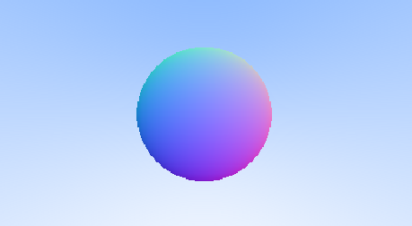

#### Some Refactoring

Now we can create a `Scene` case class which will take care of storing our Props (such as our Spheres) as well as
casting and tracing rays.

```scala
case class Scene(
  props: Seq[Prop],
):
  def propHits(ray: Ray, tMin: Double, tMax: Double): HitResult = 
    props
      .map(_.hit(ray, tMin, tMax))                       // calculate hits
      .sortWith(_.distanceToOrigin < _.distanceToOrigin) // order by closest prop to origin/camera
      .find {                                            // fetch the first (closest) hit
        case Hit(_p, _n, _t, _f) => true
        case _                   => false
      }
      .getOrElse(NoHit) // if not found then NoHit

  def rayColor(ray: Ray): Color = this.propHits(ray, 0, Double.MaxValue) match
    case NoHit => Color.white.lerpStart(0.5 * (ray.direction.unit.y + 1.0), Color.skyBlue)
    case Hit(_p, n, t, _f) => 0.5 * (Color.fromRatio(1, 1, 1) + Color.fromRatio(n.x, n.y, n.z))
```

- `propHits`: this method takes a ray and the min and max distance the origin to render. It hits all props, orders by
the closest prop hit and then fetches the first `Hit`. If such `HitResult` does not exist, it returns `NoHit`;
- `rayColor`: calls `propHits` for a single ray and returns the correct pixel color;

Now, you can create a scene with multiple Spheres, and the Image will be rendered correctly, i.e. with the closest Sphere
visible.


### 6. Antialiasing

Take a look at the [book's section on Antialiasing](https://raytracing.github.io/books/RayTracingInOneWeekend.html#antialiasing)
to better understand how it works, but essentially we need to calculate the color of random viewport ray hits inside the
pixel we're working on, and then merge these values together to get a blending color effect.

#### Creating a Renderer Case Class

Let's move the render logic from our `main.scala` file into a dedicated file. Instead of outputting an Image, we just
want it to output a Color matrix of a specified `width` and `height`. Breaking down the render logic for each color pixel:
1. Create a sequence of `SAMPLES_PER_PIXEL` random values between 0 and 1
2. Map those random values into the calculated with `u` and `v`
3. Reduce that sequence into a unique Color which contains the sum of all RGB color values
4. Divide that color by `SAMPLES_PER_PIXEL` which calculates the "average" color in the pixel

```scala
case class Renderer(viewport: Viewport, scene: Scene):
  private val SAMPLES_PER_PIXEL = 100

  def renderContent(width: Int, height: Int): Seq[Seq[Color]] =
    Seq.tabulate[Color](height, width)((h, w) =>
      Seq
        .fill(SAMPLES_PER_PIXEL)(Random.nextDouble())       // step 1
        .map { random =>                                    // step 2
          val u = (w.toDouble + random) / (width - 1)
          val v = (height - 1 - h + random) / (height - 1)
          scene.rayColor(viewport.getRay(u, v))
        }
        .reduce(_ + _)                                      // step 3
        /                                                   // step 4
          SAMPLES_PER_PIXEL,
    )
```

We'll then update our main function to:

```scala
@main
def main(): Unit = {
  val aspectRatio = 16.0 / 9.0
  val width       = 400
  val height      = (400 / aspectRatio).toInt

  val viewport = Viewport()

  val scene = Scene(
    Seq(
      Sphere(Vec3(0, -100.5, -1), 100),
      Sphere(Vec3(0, 0, -1), 0.5),
    ),
  )

  val content = Renderer(viewport, scene).renderContent(width, height)
  Image(width, height)
    .fillContent(content)
    .write(
      PrintWriter(File("output.ppm")),
    )
}
```

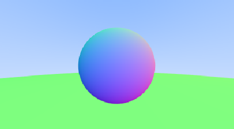

### 7. Diffuse Materials

First render:

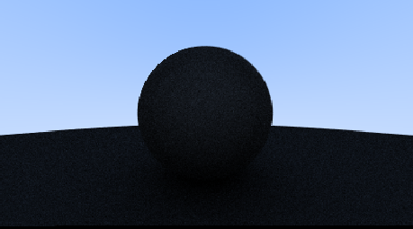

Gamma correction:

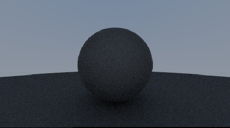

Acne fix:


Lambertian distribution:

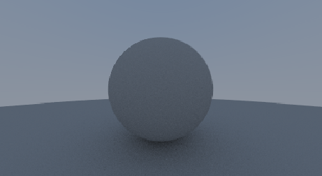

Alternative diffuse formulation:

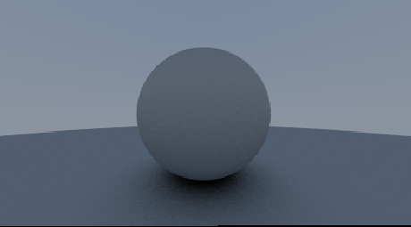

### 8. Metal

1. Making `Material` trait
2. `Renderer.rayColor` => `Lambertian.scatter`
3. `Metals.scatter`

Metals:

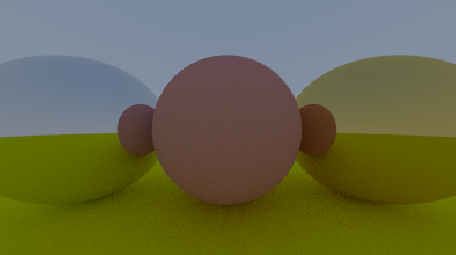

Fuzzyness:

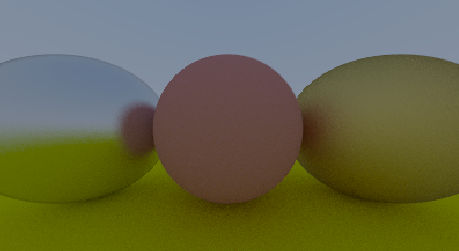

### 9. Dielectrics

## Book 2: [_Ray Tracing The Next Week_](https://raytracing.github.io/books/RayTracingTheNextWeek.html)

WIP

## Book 3: [_Ray Tracing The Rest of Your Life_](https://raytracing.github.io/books/RayTracingTheNextWeek.html)

WIP
